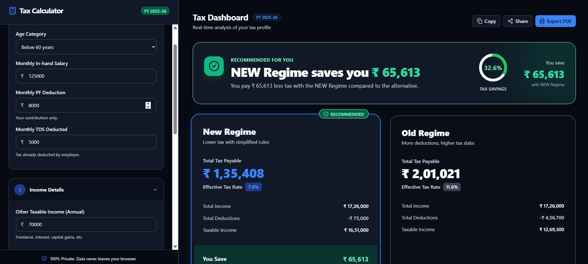
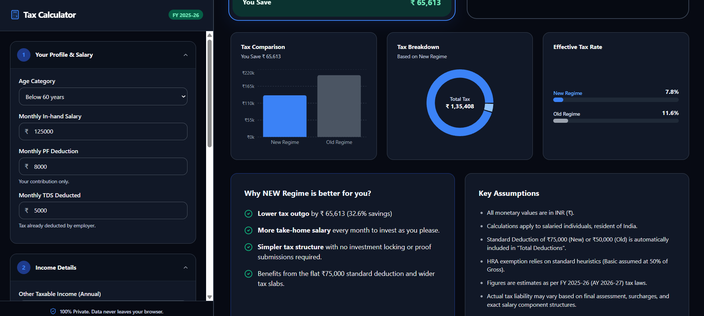

# Smart Tax Calculator for Salaried Indians (FY 2025-26)

## Dashboard Preview



## Analytics & Insights



## 📌 Project Overview
A premium, real-time web application designed to help salaried Indian professionals navigate the complexities of the FY 2025-26 tax laws. The tool instantly compares the Old and New Tax Regimes, provides a clear recommendation on which saves more money, and visualizes the tax breakdown—all within a modern, user-friendly Fintech dashboard.

## 💡 Problem Statement
Existing Indian tax calculators are built by finance experts, for finance experts. They demand complex jargon inputs ("Gross CTC", "Section 24b", "80CCD") which confuse the average salaried worker who only knows their monthly in-hand salary and basic deductions. Furthermore, most calculators lack transparency regarding *why* one regime is better than the other.

## 🚀 Solution Approach
This application strips away the jargon and translates "plain English" into complex finance logic. By combining a conversational input structure with a real-time reactive dashboard, users can play with their numbers and instantly see the impact on their take-home pay. The app features:
- **Instant Comparison**: Side-by-side breakdown of both regimes.
- **Smart Recommendation**: Algorithmic determination of the most tax-efficient regime.
- **Deep Transparency**: Dynamic insights explaining exactly *why* a regime won, complete with assumptions and calculation methodology.

## ✨ Key Features
* **Real-time Tax Engine**: Instantaneous calculation of base tax, HRA exemptions, Section 87A marginal relief, health/education cess, and high-income surcharges (up to 37%).
* **Premium Fintech UI/UX**: Designed with a "two-column" dashboard architecture. Features custom radial gauges, Recharts data visualizations (Bar & Donut charts), and micro-animations.
* **Privacy-First Architecture**: 100% client-side calculation. Data never leaves the browser.
* **PDF Export & Sharing**: Native browser printing with custom `@media print` CSS for generating professional PDF reports, alongside native Web Share API integration.
* **Robust Input Validation**: Strict enforcement of deduction caps (e.g., max ₹1.5L for 80C) with helpful UI warnings and sanitization.

## 🏗️ System Architecture
The application follows a modular, zero-backend architecture:
1. **State Management**: Context API (`TaxContext.jsx`) acts as the single source of truth for user inputs.
2. **Logic Layer**: A pure Javascript/math module (`taxEngine.js`) handles all bracket, surcharge, and deduction calculations independently of the UI.
3. **Presentation Layer**: React components (`Sidebar.jsx`, `ResultsDashboard.jsx`) consume the context and engine outputs to render real-time UI.
4. **Data Visualization**: Integrated `recharts` for dynamic SVG charting based on the winning regime's data.

## 🛠️ Tech Stack
* **Frontend Framework**: React 19 + Vite
* **Styling**: Tailwind CSS v4 (with custom typography & shadow systems)
* **Data Visualization**: Recharts (React charting library)
* **Icons**: Lucide-React
* **Deployment**: Optimized for Vercel / Netlify Edge

## 📦 Local Setup Instructions
1. Clone the repository:
   ```bash
   git clone https://github.com/yourusername/tax-calculator.git
   cd tax-calculator
   ```
2. Install dependencies:
   ```bash
   npm install
   ```
3. Start the development server:
   ```bash
   npm run dev
   ```
4. Build for production:
   ```bash
   npm run build
   ```

## 🌐 Deployment Guide
This project is optimized for drag-and-drop deployment via Netlify Drop, or continuous integration via Vercel:
```bash
npm install -g vercel
vercel login
vercel --prod
```

## 🧪 QA Testing Summary
A comprehensive test suite was executed against the `taxEngine.js` ensuring perfect mathematical compliance:
* **Normal Scenarios**: Verified standard brackets (3L, 7L, 12L, 20L).
* **Boundary Scenarios**: Verified Section 87A rebate drop-offs and implemented Marginal Relief calculations to prevent tax spikes.
* **High-Income Scenarios**: Verified escalating surcharge brackets (10%, 15%, 25%, 37%) for incomes exceeding ₹50L, ₹1Cr, and ₹5Cr.
* **Edge Cases**: Prevented negative HRA results, handled empty string coercion, and enforced maximum deduction limits programmatically.

## 📝 Known Assumptions
* Calculations assume a Resident Indian Salaried Individual under 60 years of age (unless specified in the dropdown).
* Standard deduction of ₹75,000 (New) and ₹50,000 (Old) is applied implicitly.
* HRA exemption uses standard heuristics (assuming Basic Pay is 50% of Gross).

## 🔮 Future Enhancements
* Capital Gains Tax (STCG/LTCG) integration.
* User Authentication to save profiles across devices.
* Surcharge Marginal Relief logic (for incomes hovering exactly at the ₹50L/₹1Cr boundaries).

## 💡 Lessons Learned
Transitioning from a Data/Analytics mindset to full-stack product engineering required a deep focus on **User Experience**. While the math (`taxEngine.js`) was straightforward, designing an interface that *builds trust* without overwhelming the user was the true challenge. The implementation of real-time SVG charts and immediate visual feedback (green recommendation banners) proved crucial in translating raw data into actionable insights for the end-user.
